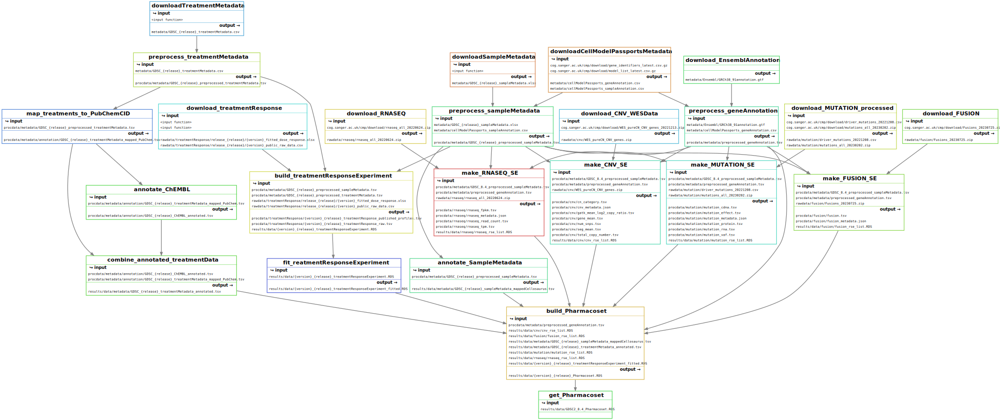

# Current Implementation


## Workflow Directory:

```bash
.
├── config
│   └── pipeline.yaml
├── envs
│   ├── cnv.yaml
│   ├── fusion.yaml
│   ├── metadata.yaml
│   ├── microarray.yaml
│   ├── mutation.yaml
│   ├── PharmacoSet.yaml
│   ├── rnaseq.yaml
│   ├── snakemake.yaml
│   ├── test.yaml
│   └── treatmentResponse.yaml
├── profiles
│   └── config.yaml
├── rules
│   ├── cnv.smk
│   ├── fusion.smk
│   ├── metadata.smk
│   ├── microarray.smk
│   ├── mutation.smk
│   ├── rnaseq.smk
│   └── treatmentResponse.smk
├── scripts
│   ├── build_PharmacoSet.R
│   ├── cnv
│   │   └── make_CNV_SE.R
│   ├── fusion
│   │   └── make_FUSION_SE.R
│   ├── metadata
│   │   ├── annotate_ChEMBL.R
│   │   ├── annotate_PubChemCIDS.R
│   │   ├── combine_annotated_treatmentData.R
│   │   ├── getCellosaurus
│   │   │   ├── getCellosaurusObject.R
│   │   │   └── mapCellosaurus.R
│   │   ├── map_treatments_to_PubChemCID.R
│   │   ├── preprocess_geneAnnotation.R
│   │   ├── preprocess_sampleMetadata.R
│   │   ├── preprocess_treatmentMetadata.R
│   │   └── utils.R
│   ├── microarray
│   │   └── make_MICROARRAY_SE.R
│   ├── mutation
│   │   └── make_MUTATION_SE.R
│   ├── rnaseq
│   │   └── make_RNASEQ_SE.R
│   ├── template.R
│   └── treatmentResponse
│       └── build_treatmentResponseExperiment.R
└── Snakefile
```  

# Setup

Ensure you have conda installed. If not, install [miniconda](https://docs.conda.io/en/latest/miniconda.html).
Install mamba for faster package management:

``` bash
conda install mamba -n base -c conda-forge 
```

Create a conda environment with the required dependencies:

```bash
mamba env create -f GDSC-Pharmacoset_Snakemake/workflow/envs/snakemake.yaml
```

Activate the environment:

```bash
conda activate gdsc_pharmacoset
```


## Workflow Execution:

### Main Run
```bash
snakemake --profile workflow/profiles/
```

### Dry Run
```bash
snakemake --profile workflow/profiles/ --dryrun
```

### Create all Conda Environments
```bash
snakemake --profile workflow/profiles/ --use-conda --conda-create-envs-only
```


## RuleGraph 
``` bash
snakemake --profile workflow/profiles/ --rulegraph | dot -Tsvg > resources/rulegraph.svg
```

## Directed Acyclic Graph (DAG)
``` 
snakemake --profile workflow/profiles/ --dag | dot -Tsvg > resources/dag.svg
```


## filegraph
```
snakemake --profile workflow/profiles/  --filegraph | dot -Tsvg > resources/filegraph.svg
```



